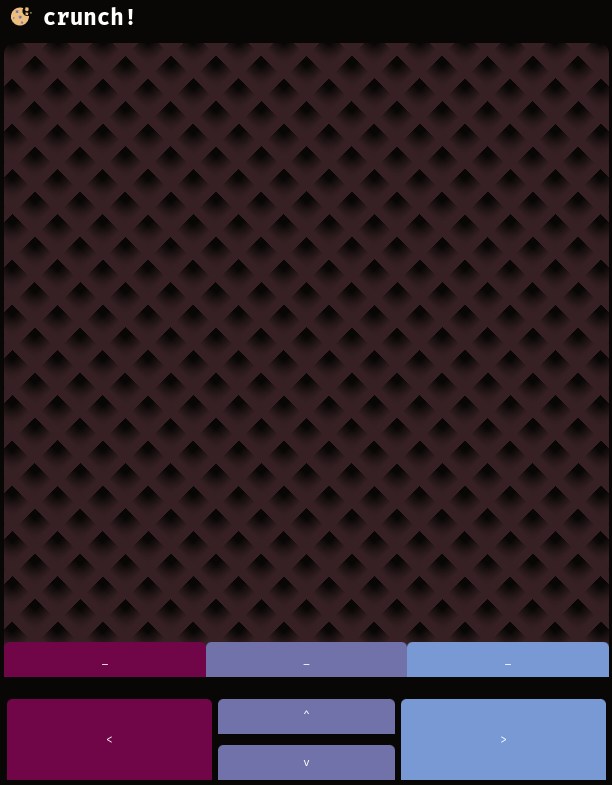

# crunch

Very simple remote mouse + keyboard application based on WebSocket protocol.

## Features

- touchpad-like interface for mouse motion
- buttons for directional keys

## Configuration

In [server.c](./server.c) you can redefine `INTERFACE` to match your interface device name 
and you can also change `PORT` to make the server listen on a different port.
Additionally you can enable logging more info by changing `LOG_EVENTS` to 1.

## Quick start

Dependencies:

- libmd
- Xlib

Optional dependencies:

- [qrencode](https://fukuchi.org/works/qrencode/) (can be disabled by unsetting `USE_QRENCODE`)

```
make
./server
```

In result you should be greeted with a link to web ui of this app, and qr code leading to
the same address (if you have it enabled).

## Screenshot



